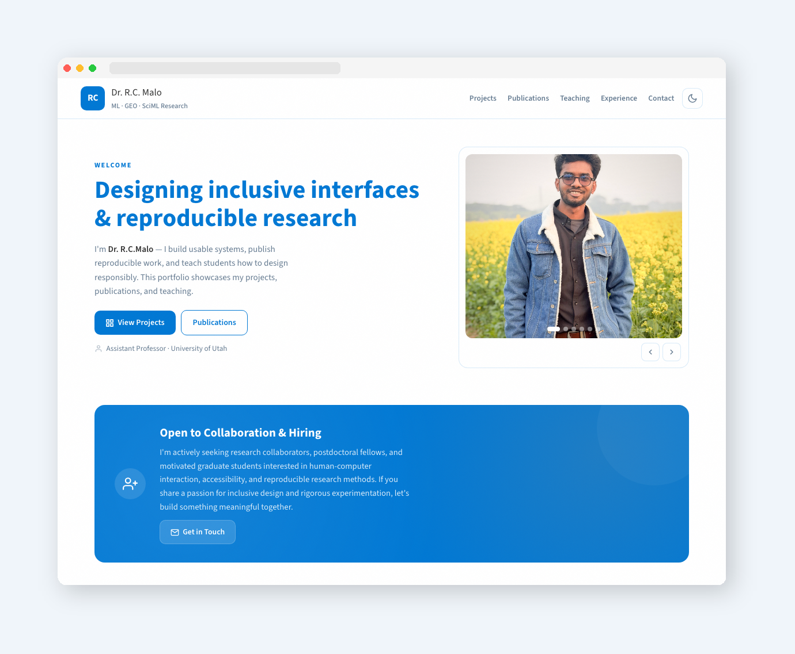
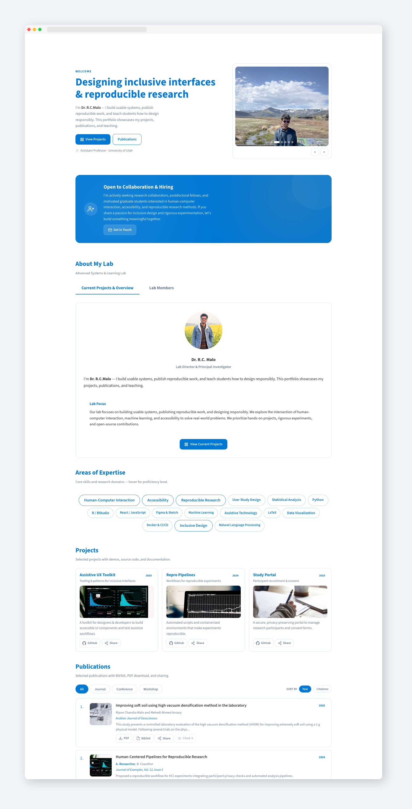
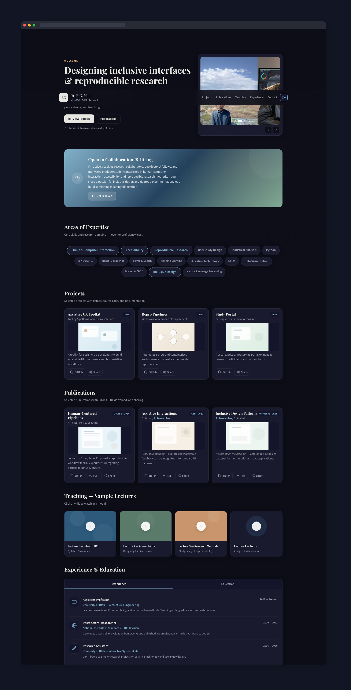
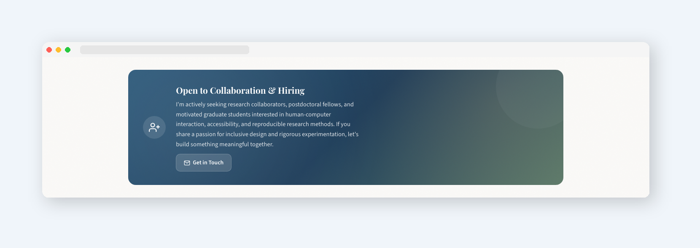
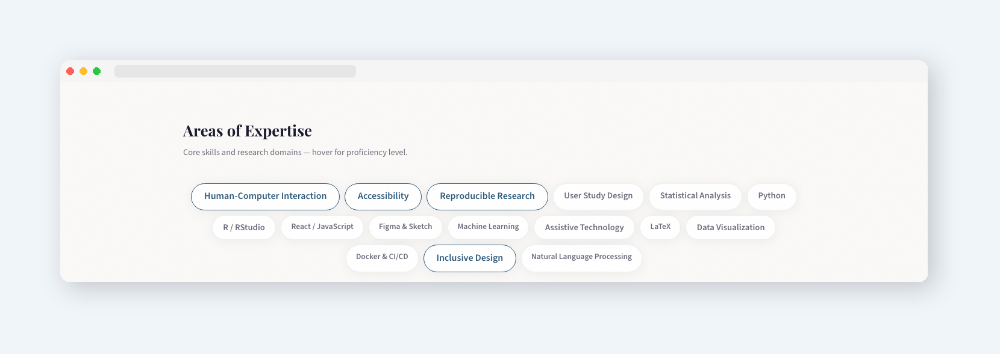
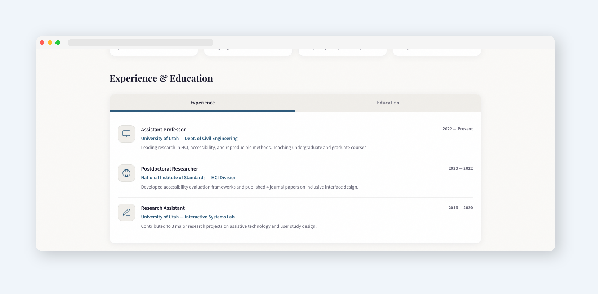

  


<div align="center">

[](https://acadpro.netlify.app)

</div>

**Preview**



# Academic Portfolio Template

**A modern, single-page academic portfolio built with pure HTML, CSS, and JavaScript.**
Designed for researchers, professors, and academics who want a polished online presence without frameworks or dependencies.

---

> **If this project is useful to you, please consider giving it a star.**
> Stars help others discover this project and motivate continued development.
>
> [](https://github.com/riponcm/acadpro)

---

## Overview

This is a complete, production-ready academic portfolio website contained in a single `index.html` file. It requires no build tools, no package managers, and no server-side code. Open it in a browser and it works.

The design follows an editorial aesthetic with warm muted tones, refined typography, and subtle animations. It includes light and dark mode, responsive layout, and all interactive features built from scratch.

---

## Screenshots


**Light Mode**



**Dark Mode**



**Open to Work Banner**



**Expertise Cloud**



**Experience and Education Tabs**



---

## Page Structure

| # | Section | Description |
|:---:|:---|:---|
| 01 | **Header** | Sticky navigation with glass blur effect and theme toggle |
| 02 | **Hero** | Welcome text with auto-rotating photo carousel |
| 03 | **Hiring Banner** | Highlighted "Open to Work" section with animated pulse |
| 04 | **Expertise Cloud** | Interactive skill tags with proficiency tooltips |
| 05 | **Projects** | Card grid with SVG illustrations, GitHub links, share dropdown |
| 06 | **Publications** | Card grid with BibTeX download, PDF button, social sharing |
| 07 | **Teaching** | Video tiles that open YouTube in a new tab |
| 08 | **Experience** | Tabbed panel with work history and education with logos |
| 09 | **Awards** | Compact cards with external links and hover arrows |
| 10 | **Contact** | Embedded Google Map, contact details, and social links |
| 11 | **Footer** | Copyright, author credit, version, and repo link |
```
```
## Features
```
### Design

- Clean editorial typography using Playfair Display and Source Sans 3
- Light and dark theme with smooth toggle and persistence via localStorage
- Warm muted color palette -- slate blue, copper, sage green
- Subtle grain texture overlay for depth
- Glassmorphism header with backdrop blur
- Responsive layout -- works on desktop, tablet, and mobile
- Print-friendly styles

### Interactive Elements

- Auto-rotating photo carousel with dot indicators and navigation arrows
- Scroll-triggered reveal animations with staggered timing
- Expertise cloud with hover tooltips showing proficiency levels
- Tabbed content panel for experience and education
- Share dropdown with Copy Link, Facebook, LinkedIn, and X support
- BibTeX download button that generates and saves citation files
- Video tiles that open lectures directly on YouTube
- Awards and certifications as clickable external links with hover effects

### Technical

- Single HTML file -- no build step, no dependencies
- All icons are inline SVG -- no icon library needed
- Google Fonts loaded via preconnect for performance
- Fully semantic HTML with ARIA labels
- Zero JavaScript frameworks -- pure vanilla JS
- No cookies, no analytics, no tracking

```

## Deployment

```
```
### Option 1 -- Netlify (Recommended for beginners)
```
1. Download or clone this repository.
2. Go to [app.netlify.com](https://app.netlify.com) and sign in.
3. Click **"Add new site"** then **"Deploy manually"**.
4. Drag the project folder (containing `index.html`) into the upload area.
5. Your site is live. Netlify provides a free URL and HTTPS.

To update: go to the **Deploys** tab on your site dashboard, scroll down, and drag the updated folder into the re-deploy area.
```
### Option 2 -- GitHub Pages
```
1. Fork or clone this repository to your GitHub account.

2. Go to your repository **Settings** then **Pages**.

3. Under **Source**, select the branch (usually `main`) and root folder.

4. Click **Save**. Your site will be available at:

5. Any push to the selected branch will automatically redeploy.
```
### Option 3 -- Clone and Run Locally

```bash
git clone https://github.com/riponcm/acadpro.git
cd YOUR_REPO
```

Open `index.html` directly in any modern browser. Everything works offline except Google Fonts, Google Maps, YouTube links, and Unsplash images.

For full functionality during local development, run a local server:

```bash
# Python
python3 -m http.server 8000

# Node.js
npx serve .
```

Then visit `http://localhost:8000` in your browser.

---

## Customization Guide

### Replace Personal Information

Open `index.html` in any text editor and search for the following placeholder values:

| Placeholder | Location | Replace With |
|:---|:---|:---|
| `Dr. R.C Malo` | Hero, header, footer, contact | Your name |
| `researcher@example.edu` | Contact section | Your email |
| `+1 (404) 555-1234` | Contact section | Your phone |
| `Example University` | Hero role, experience | Your institution |
| `AR` | Logo in header | Your initials |
| Photo carousel URLs | Hero section | Your own photo URLs |
| `data-video` URLs | Teaching section | Your YouTube video IDs |
| Google Maps embed URL | Contact section | Your location |

### Replace Content Sections

- **Projects** -- Edit card titles, descriptions, GitHub URLs, and SVG illustrations.
- **Publications** -- Edit titles, authors, venues, BibTeX data, and PDF links.
- **Expertise** -- Edit skill tag text and `data-level` attributes (expert, advanced, intermediate).
- **Experience / Education** -- Edit timeline entries, logos, and descriptions.
- **Awards** -- Edit titles, subtitles, and external `href` links.

### Adjust Colors

All colors are defined as CSS variables at the top of the style block. Edit the `:root` section for light mode and `[data-theme="dark"]` for dark mode.

---

## Custom Design Service

If you need a tailored version of this portfolio with custom branding, unique layout modifications, additional sections, or integration with a CMS or backend system, I am available for commissioned work.

**Contact for custom design inquiries:**

| | |
|:---|:---|
| **Author** | Ripon Chandra Malo |
| **LinkedIn** | *https://www.linkedin.com/in/engr-ripon/* |

Please include a brief description of what you need and your timeline. Typical turnaround for custom modifications is 3 to 7 business days depending on scope.

---

## Usage Rules

This project is released under a restricted license. Please read the following terms carefully before using, modifying, or distributing this work.

### Permitted

- You may use this template for your own personal or academic portfolio.
- You may modify all content, colors, fonts, images, sections, and layout to suit your needs.
- You may deploy the modified version on any hosting platform.
- You may use it for non-commercial purposes without prior written permission.

### Required

- **Footer attribution must remain visible.** The footer must contain a working link back to this GitHub repository. You may change the wording or styling of the credit line, but the link to this repository must be present and functional on every published page.
- **Source attribution must remain in the HTML.** The copyright comment block at the top of the HTML source must not be removed or altered in a way that obscures the original author.

### Not Permitted

- You may NOT sell this template or any modified version of it, whether as a standalone product, as part of a bundle, or as a service offering.
- You may NOT redistribute this template on any marketplace, template directory, or download site without explicit written permission from the author.
- You may NOT remove the footer repository link from any published deployment.
- You may NOT claim this work as your own original creation.
- You may NOT use this template in any commercial product or service that generates revenue directly from the template itself.

### Summary

> **Use it freely. Customize everything. Keep the footer link. Do not sell it.**

Violations of these terms may result in a takedown request. If you are unsure whether your intended use is permitted, please contact the author before proceeding.

---

## File Structure

```
repository/
  |
  |-- index.html
  |-- README.md 
  |-- LICENSE.txt 
  |-- screenshots/
       |-- light-mode.png
       |-- dark-mode.png
       |-- hero.png
       |-- banner.png
       |-- expertise.png
       |-- tabs.png
```

---

## Technical Notes

- Tested on Chrome, Firefox, Safari, and Edge (latest versions).
- Mobile responsive down to 320px viewport width.
- Lighthouse score: 95+ Performance, 100 Accessibility, 100 Best Practices, 100 SEO (when hosted over HTTPS).
- Total file size: approximately 60 KB uncompressed, under 20 KB gzipped.
- No external JavaScript dependencies. No npm. No Webpack. No React.

---

**AcadPro-An Academic Portfolio Template** -- Version 1.0.0

Designed by **Ripon Chandra Malo**

---

> **If this project helped you, consider buying me a coffee.**
<div align="center">

[](https://www.buymeacoffee.com/riponce)            [](https://github.com/riponcm/acadpro)

</div>

