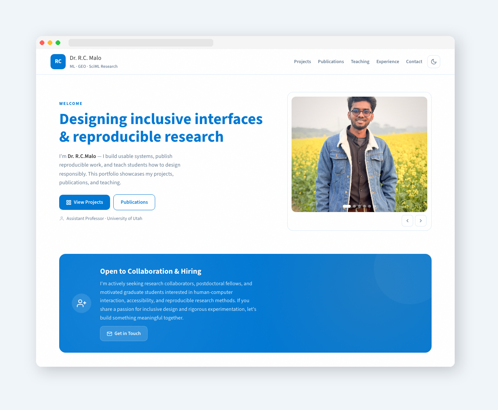

  


<div align="center">

[](https://acadpro.netlify.app)

</div>

**Preview**



# Academic Portfolio Template

**A modern, JSON-driven academic portfolio built with pure HTML, CSS, and JavaScript.**
Designed for researchers, professors, and academics who want a polished online presence without frameworks or dependencies. Edit one JSON file to update your entire site.

---

> **If this project is useful to you, please consider giving it a star.**
> Stars help others discover this project and motivate continued development.
>
> [](https://github.com/riponcm/acadpro)

---

## What's New in V2.0.0

- All site content is now driven by a single `data.json` file — no more editing HTML
- **New Section: "About My Lab"** with comprehensive tabbed interface for Lab Focus and Hierarchical Member Tree Display
- Optional Google Scholar integration to auto-update citation counts
- Two publication display styles — card grid or tabbed list — switchable via JSON
- Dynamic Publication sorting by "Year" or "Citations" with "Load More" pagination
- BibTeX Copy-to-Clipboard modal
- Every section (projects, publications, teaching, experience, education, awards, contact) is fully configurable from JSON
- Configurable Default Theme (`light`, `dark`, `blue`) directly controlled from `data.json`

---

## Overview

This is a complete, production-ready academic portfolio website. All content lives in `data.json` — edit that one file and the website updates automatically. No build tools, no package managers, no server-side code.

The design follows an editorial aesthetic with warm muted tones, refined typography, and subtle animations. It includes light and dark mode, responsive layout, and all interactive features built from scratch.

---
---

## Page Structure

| # | Section | JSON Key | Description |
|:---:|:---|:---|:---|
| 01 | **Header** | `profile` | Sticky navigation with glass blur effect and theme toggle |
| 02 | **Hero** | `profile` & `projects` | Welcome text with auto-rotating photo carousel (combines profile pics + project pics) |
| 03 | **Hiring Banner** | `hiring` | Highlighted "Open to Work" section with animated pulse |
| 04 | **About My Lab** | `lab` | Tabbed section outlining lab focus, director details, and an eye-catching hierarchical lab members tree |
| 05 | **Expertise Cloud** | `expertise` | Interactive skill tags with proficiency tooltips |
| 06 | **Projects** | `projects` | Card grid with real images, GitHub links, share dropdown |
| 07 | **Publications** | `publications` | Tabbed list with auto-fetch from Scholar, "Load More" pagination, Sorting (Year/Citations), and BibTeX copy modal |
| 08 | **Teaching** | `teaching` | Video tiles that open YouTube in a modal |
| 09 | **Experience** | `experience` | Tabbed panel — work history with icons |
| 10 | **Education** | `education` | Tabbed panel — degrees with university logos |
| 11 | **Awards** | `awards` | Compact cards with external links and hover arrows |
| 12 | **Contact** | `contact` | Embedded Google Map, contact details, and social links |
| 13 | **Footer** | `footer` | Copyright, author credit, version, and repo link |

---

## Installation

### Step 1 — Clone the Repository

```bash
git clone https://github.com/riponcm/acadpro.git
cd acadpro
```

### Step 2 — Edit Your Data

Open `data.json` in any text editor (VS Code recommended) and replace the demo content with your own information. See the Customization Guide below for details on each section.

### Step 3 — Test Locally

Since the site loads `data.json` via JavaScript fetch, you need a local server to test:

```bash
# Using Python (recommended)
python3 -m http.server 8000

# Using Node.js
npx serve .
```

Then open `http://localhost:8000` in your browser.

**Note:** Opening `index.html` directly as a file will not work because browsers block `fetch()` requests from `file://` protocol. Always use a local server for testing.

### Step 4 (Optional) — Auto-Update from Google Scholar

```bash
pip install scholarly
python fetch_scholar.py --scholar-id YOUR_SCHOLAR_ID
```

Your Google Scholar ID is the value after `user=` in your profile URL:
`https://scholar.google.com/citations?user=YOUR_SCHOLAR_ID`

This updates citation counts for existing papers and adds new ones with placeholder images. Your manual edits (images, PDFs, descriptions) are never overwritten. A backup is saved as `data.backup.json` before each update.

---

## Deployment

### Option 1 — Netlify (Recommended)

1. Go to [app.netlify.com](https://app.netlify.com) and sign in.
2. Click **"Add new site"** then **"Deploy manually"**.
3. Drag your project folder (containing `index.html` and `data.json`) into the upload area.
4. Your site is live. Netlify provides a free URL and HTTPS.

To update: drag the updated folder into the re-deploy area on the **Deploys** tab.

### Option 2 — GitHub Pages

1. Push your repository to GitHub.
2. Go to repository **Settings** then **Pages**.
3. Under **Source**, select branch `main` and root folder `/`.
4. Click **Save**. Your site will be available at `https://username.github.io/repo-name`.
5. Any push to `main` will automatically redeploy.

### Option 3 — Vercel

1. Go to [vercel.com](https://vercel.com) and import your GitHub repository.
2. No build settings needed — it serves static files automatically.
3. Deploys on every push.

---

## File Structure

```
acadpro/
  |-- index.html              <- Main site (reads data.json, renders everything)
  |-- data.json               <- All site content (edit this file)
  |-- fetch_scholar.py        <- Optional: auto-pull from Google Scholar
  |-- LICENSE.txt             <- License terms
  |-- README.md               <- This file
  |-- .gitignore
  |-- screenshots/
       |-- light-mode.png
       |-- dark-mode.png
       |-- hero.png
       |-- banner.png
       |-- expertise.png
       |-- tabs.png
```

---

## Customization Guide

### How It Works

All site content is stored in `data.json`. The `index.html` file reads this JSON on page load and renders every section dynamically. You never need to touch the HTML — just edit the JSON and push.

### Profile and Hero Section

```json
"profile": {
  "name": "Dr. Your Name",
  "initials": "YN",
  "tagline": "Your Research Areas",
  "headline": "Your headline text",
  "bio": "Your bio with <strong>HTML</strong> allowed",
  "role": "Your Title",
  "affiliation": "Your University",
  "photos": [
    { "src": "https://your-photo-url.jpg", "alt": "Description" }
  ]
}
```

### Hiring Banner

Toggle the banner on or off:

```json
"hiring": {
  "enabled": true,
  "title": "Open to Collaboration",
  "description": "Your hiring message here."
}
```

Set `enabled` to `false` to hide the banner completely.

### About My Lab

Manage your lab's overview and member hierarchy directly in the JSON file.

```json
"lab": {
  "directorName": "Dr. Your Name",
  "title": "Your Lab Name",
  "description": "Lab focus and descriptions go here. Explaining what you build.",
  "members": [
    {
      "roleGroup": "Postdoctoral Researchers",
      "people": [
        { "name": "Dr. Alice Smith", "role": "Postdoc, ML", "image": "img1.png" }
      ]
    },
    {
      "roleGroup": "Ph.D. Students",
      "people": [
        { "name": "Charlie Davis", "role": "Ph.D. Candidate", "image": "img2.png" }
      ]
    }
  ]
}
```

### Expertise Tags

Add or remove skills. Levels control visual size: `expert` (largest), `advanced`, `intermediate`.

```json
"expertise": [
  { "name": "Machine Learning", "level": "expert" },
  { "name": "Python", "level": "advanced" }
]
```

### Projects

```json
"projects": [
  {
    "title": "Project Name",
    "subtitle": "Short description",
    "year": "2024",
    "image": "https://your-image-url.jpg",
    "description": "Detailed description.",
    "github": "https://github.com/you/repo",
    "url": "https://project-url.com"
  }
]
```

### Publications

Each publication entry:

```json
{
  "title": "Paper Title",
  "authors": "A. You, B. Coauthor",
  "highlightAuthor": "A. You",
  "venue": "Journal Name, Vol. X",
  "year": 2024,
  "type": "journal",
  "image": "https://card-image.jpg",
  "thumbnail": "https://list-thumbnail.jpg",
  "description": "Paper abstract or summary.",
  "pdfUrl": "https://link-to-pdf.pdf",
  "url": "https://paper-url.com",
  "citations": 42,
  "bibtex": "@article{key,title={...},author={...},year={2024}}"
}
```

The `type` field accepts `journal`, `conference`, or `workshop` — this controls the filter tabs.

The `highlightAuthor` field is your name as it appears in the authors string — it gets bolded and color-highlighted automatically.

### Publication Display Style

In the `settings` section of `data.json`:

```json
"settings": {
  "publicationStyle": "alt"
}
```

Options: `"alt"` (tabbed list view), `"card"` (grid cards), or `"both"` (shows both styles).

### Teaching

```json
"teaching": [
  {
    "title": "Lecture 1 — Topic",
    "subtitle": "Short description",
    "videoUrl": "https://www.youtube.com/embed/VIDEO_ID",
    "bgColor": "#2d5a7b"
  }
]
```

### Experience and Education

Experience uses icon names. Education uses logo image URLs.

```json
"experience": [
  {
    "title": "Job Title",
    "organization": "Company or University",
    "description": "What you did.",
    "years": "2022 — Present",
    "icon": "monitor"
  }
],
"education": [
  {
    "title": "Ph.D. in Your Field",
    "organization": "University Name",
    "description": "Details about your degree.",
    "years": "2016 — 2020",
    "logo": "https://university-logo-url.png"
  }
]
```

Available icon names: `monitor`, `globe`, `pencil`, `code`, `shield`, `cap`, `star`, `award`.

### Awards

```json
"awards": [
  {
    "title": "Best Paper Award",
    "subtitle": "Conference Name, 2024",
    "url": "https://link-to-award.com",
    "icon": "award",
    "iconColor": "warm"
  }
]
```

Icon color options: `"warm"` (copper), `"accent"` (blue), `"sage"` (green).

### Contact and Socials

```json
"contact": {
  "email": "you@university.edu",
  "phone": "+1 (555) 000-0000",
  "office": "Room 100, Building Name",
  "mapEmbed": "https://www.google.com/maps/embed?pb=YOUR_EMBED_URL",
  "socials": [
    { "platform": "google-scholar", "url": "https://scholar.google.com/..." },
    { "platform": "github", "url": "https://github.com/you" },
    { "platform": "linkedin", "url": "https://linkedin.com/in/you" },
    { "platform": "orcid", "url": "https://orcid.org/0000-..." }
  ]
}
```

Supported social platforms: `google-scholar`, `github`, `linkedin`, `orcid`, `twitter`.

### Adjust Colors

All colors are CSS variables at the top of `index.html`. Edit `:root` for light mode and `[data-theme="dark"]` for dark mode.

You can also set the default appearance in `data.json` under `settings`:

```json
"settings": {
  "theme": "blue" // Available options: "light", "dark", "blue"
}
```
The "blue" theme uses a crisp white background with primary blue accents. Users will still be able to toggle to a dark mode via the UI button.

---

## Google Scholar Integration

The included `fetch_scholar.py` script connects to Google Scholar and updates your `data.json` automatically.

### Setup

```bash
pip install scholarly
```

### First Run

Add your Scholar ID to `data.json`:

```json
"settings": {
  "scholarId": "YOUR_SCHOLAR_ID"
}
```

Then run:

```bash
python fetch_scholar.py
```

### What It Does

- Fetches all your publications from Google Scholar
- For **existing papers** in `data.json`: updates citation count only
- For **new papers**: adds them with placeholder images (you replace later)
- **Never deletes or overwrites** your manual edits (images, PDFs, descriptions)
- Creates `data.backup.json` before every save

### Recommended Workflow

Run the script monthly to keep citations current:

```bash
python fetch_scholar.py
# Review data.json for new entries
# Replace placeholder images for new papers
# Add PDF URLs
git add data.json
git commit -m "Update publications from Scholar"
git push
```

### Important Notes

- Google Scholar has no official API — the script uses the `scholarly` library
- Google may rate-limit requests; if blocked, wait and try again later
- The script takes 30-60 seconds depending on your number of publications

---

## Features

### Design

- Clean editorial typography using Playfair Display and Source Sans 3
- Light and dark theme with smooth toggle and persistence via localStorage
- Warm muted color palette — slate blue, copper, sage green
- Subtle grain texture overlay for depth
- Glassmorphism header with backdrop blur
- Responsive layout — works on desktop, tablet, and mobile
- Print-friendly styles

### Interactive Elements

- Auto-rotating photo carousel with dot indicators and navigation arrows
- Scroll-triggered reveal animations with staggered timing
- Expertise cloud with hover tooltips showing proficiency levels
- Tabbed content panel for experience and education
- Share dropdown with Copy Link, Facebook, LinkedIn, and X support
- BibTeX download button that generates and saves citation files
- Publication filter tabs (All, Journal, Conference, Workshop)
- Video tiles that open lectures in a YouTube modal
- Awards and certifications as clickable external links

### Technical

- JSON-driven — all content in one file, zero HTML editing needed
- Single HTML file — no build step, no dependencies
- All icons are inline SVG — no icon library needed
- Google Fonts loaded via preconnect for performance
- Fully semantic HTML with ARIA labels
- Zero JavaScript frameworks — pure vanilla JS
- No cookies, no analytics, no tracking

---

## Custom Design Service

If you need a tailored version of this portfolio with custom branding, unique layout modifications, additional sections, or integration with a CMS or backend system, I am available for commissioned work.

**Contact for custom design inquiries:**

| | |
|:---|:---|
| **Author** | Ripon Chandra Malo |
| **LinkedIn** | *https://www.linkedin.com/in/engr-ripon/* |

Typical turnaround for custom modifications is 3 to 7 business days depending on scope.

---

## Usage Rules

This project is released under a restricted license. Please read the following terms carefully.

### Permitted

- Use this template for your own personal or academic portfolio.
- Modify all content, colors, fonts, images, sections, and layout.
- Deploy the modified version on any hosting platform.
- Use for non-commercial purposes without prior written permission.

### Required

- **Footer attribution must remain visible.** The footer must contain a working link back to this GitHub repository.
- **Source attribution must remain in the HTML.** The copyright comment block at the top of the source must not be removed.

### Not Permitted

- Sell this template or any modified version.
- Redistribute on any marketplace, template directory, or download site.
- Remove the footer repository link.
- Claim this work as your own original creation.
- Use in any commercial product that generates revenue from the template.

**Summary:** Use it freely. Customize everything. Keep the footer link. Do not sell it.

---

## Technical Notes

- Tested on Chrome, Firefox, Safari, and Edge (latest versions).
- Mobile responsive down to 320px viewport width.
- Lighthouse score: 95+ Performance, 100 Accessibility, 100 Best Practices, 100 SEO (when hosted over HTTPS).
- Total file size: approximately 55 KB HTML + 15 KB JSON uncompressed.
- No external JavaScript dependencies. No npm. No Webpack. No React.
- Requires a web server for local testing (uses `fetch()` to load JSON).

---

**AcadPro — An Academic Portfolio Template** — Version 2.0.0

Designed by **Ripon Chandra Malo**

---

> **If this project helped you, consider buying me a coffee.**
<div align="center">

[](https://www.buymeacoffee.com/riponce)             [](https://github.com/riponcm/acadpro)

</div>

<p align="center">
  <a href="#">
      
   </a>
</p>
